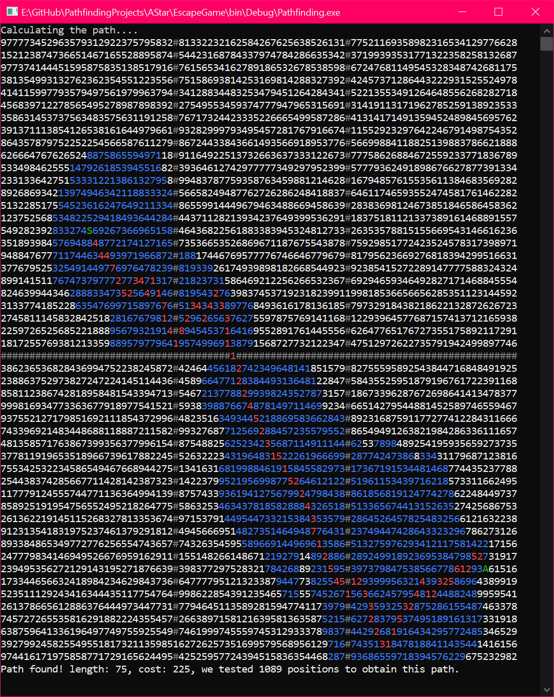

## Escape Game C#

## Skills :fire:
- **Programming Languages**: C#
- **Tools**: Visual Studio Community 2019, Git

## Heuristics used 📈
<h4>Euclidian Distance</h4>
    
<ul>
  <li>
    Incoming
  </li>
</ul>
 
<h4>Manhattan Distance</h4>
<ul>
  <li>
    Incoming
  </li>
</ul>
