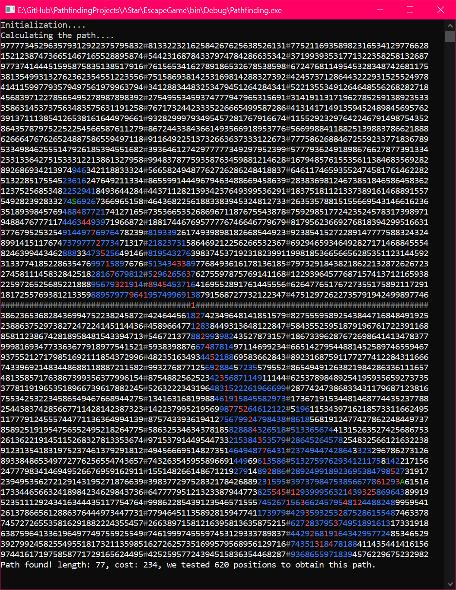
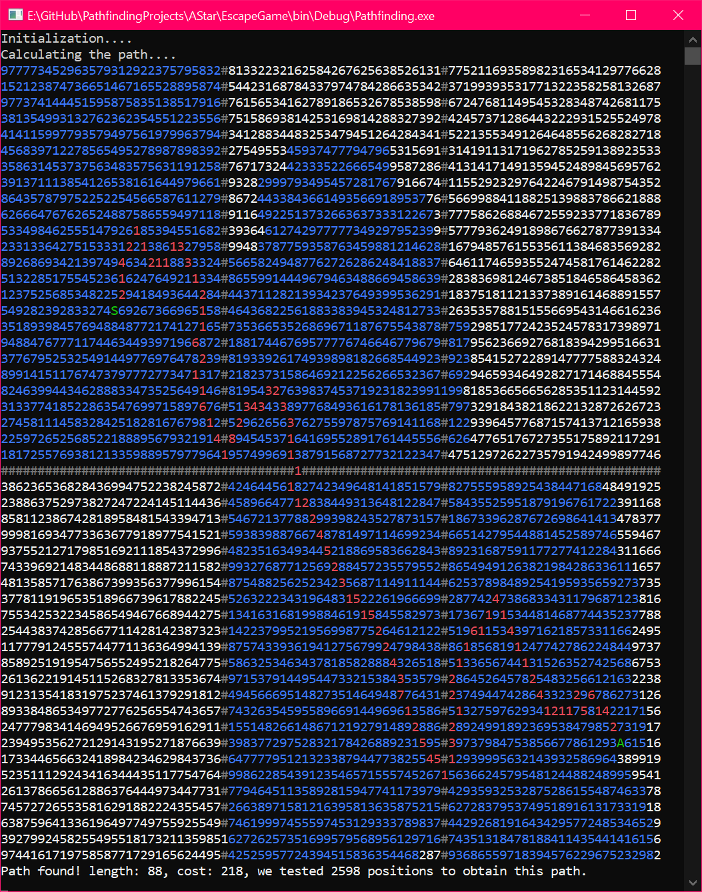
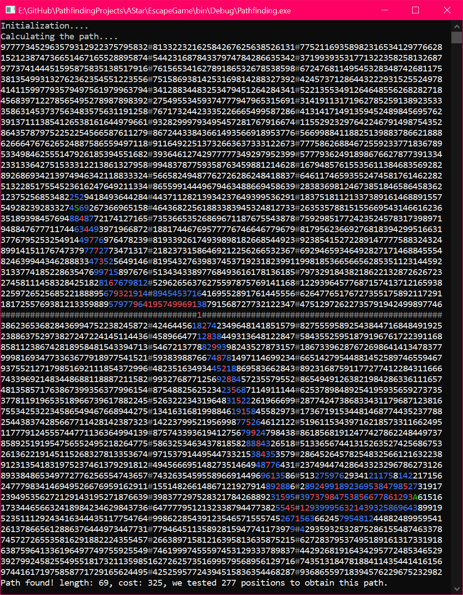

## Escape Game C#

## Skills :fire:
- **Programming Languages**: C#
- **Tools**: Visual Studio Community 2019, Git

## Goals 🎯
- In a 2D random-generated weighted grid (game) subdivised in multiple subgrids (rooms), find the optimal path from the starting location to the destination while navigating from room to room.
- Test different and compare different heuristics.
- There are 3 rooms at the top and 3 rooms at the bottom, and each of the 3 rooms are connected to another through one door, but there's only room of the 3 that is connected to a room from the other side of the grid.
- So, we have to find where that door is if the destination is on the other side of the grid.

## Heuristics used 📈
_all the following examples share the same random seed_
<h4>Euclidian Distance</h4>
    
<ul>
  <li>
    Euclidean Distance is the straight-line distance between two points in Euclidean space. This heuristic is often used when the path can be in any direction, such as in a continuous space or when diagonal movement is allowed on a grid.
  </li>
    <li>
      d = sqrt((x2 - x1)^2 + (y2 - y1)^2)
  </li>
</ul>

<h4>Manhattan Distance</h4>
    
<ul>
  <li>
    Manhattan Distance is used when movement is restricted to horizontal and vertical lines, as in a grid-based map like a city layout (hence the name, referring to the grid layout of streets in Manhattan). This heuristic is ideal when the agent cannot move diagonally.
  </li>
    <li>
      d = abs(x2 - x1) + abs(y2 - y1)
  </li>
</ul>

<h4>Dijkstra</h4>
    
<ul>
  <li>
    When using A* with no heuristic (i.e., the heuristic function always returns 0), the algorithm essentially becomes Dijkstra's Algorithm. In this case, the algorithm does not estimate the cost to the goal and only considers the cost from the start node to the current node. This is not actually a heuristic but rather the absence of one, turning A* into a uniform cost search.
  </li>
<li>
    h(n) = 0
</li>
</ul>

<h4>Euclidean Squared Distance</h4>
    
<ul>
  <li>
    The Euclidean Squared Distance heuristic uses the square of the Euclidean distance instead of the actual Euclidean distance. This heuristic can be used to save computation time since calculating square roots (as required for the true Euclidean distance) is computationally intensive.
  </li>
    <li>
    d_squared = (x2 - x1)^2 + (y2 - y1)^2
  </li>
</ul>
